<!-- markdownlint-disable MD029 -->

# adonisjs-react-rbac-dashboard

An open-source fullstack application template built with AdonisJS and ReactJS with Role-Based Access Control (RBAC) system also with a dashboard and basic shadCN / Mantine styled UI.

This template is currently made using adonisjs/core v6.x.

## Stacks

- AdonisJS
- Lucid ORM from AdonisJS
- ReactJS with InertiaJS
- TailwindCSS
- Mantine UI
- Mantine DataTable
- TypeScript

## Preview

| Feature                | Screenshots                                                                                                                                 |
| ---------------------- | ------------------------------------------------------------------------------------------------------------------------------------------- |
| **Homepage**           | 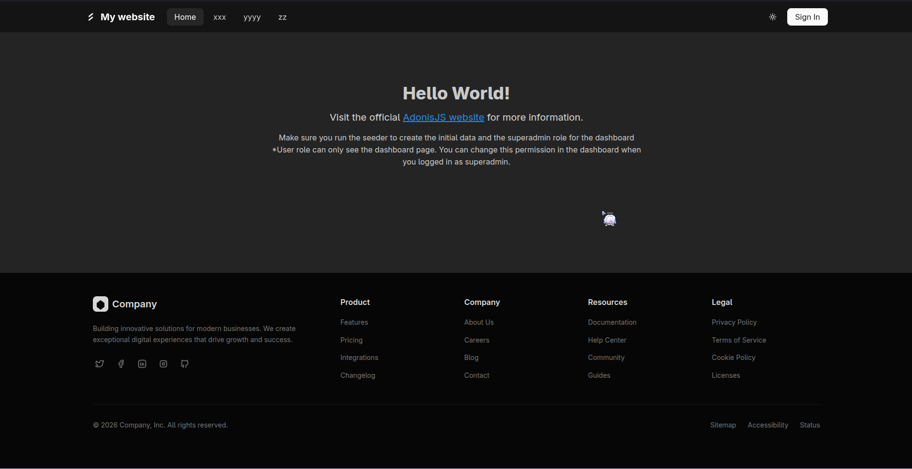 <br/> 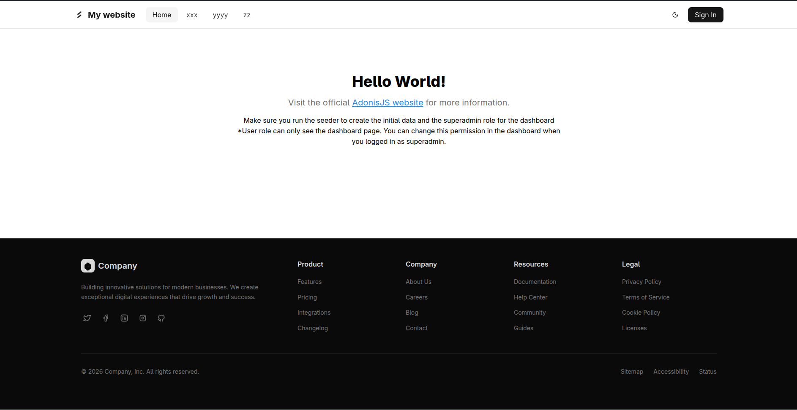                                           |
| **Dashboard**          | 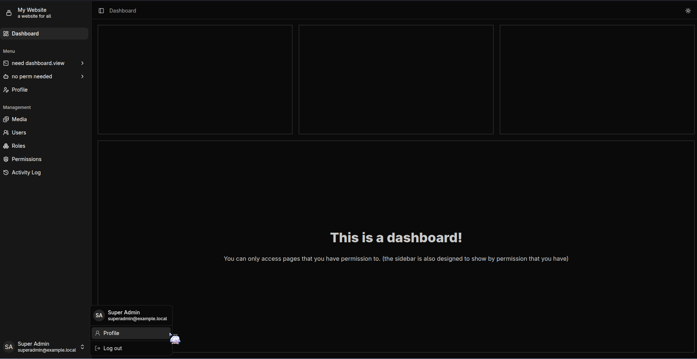 <br/> 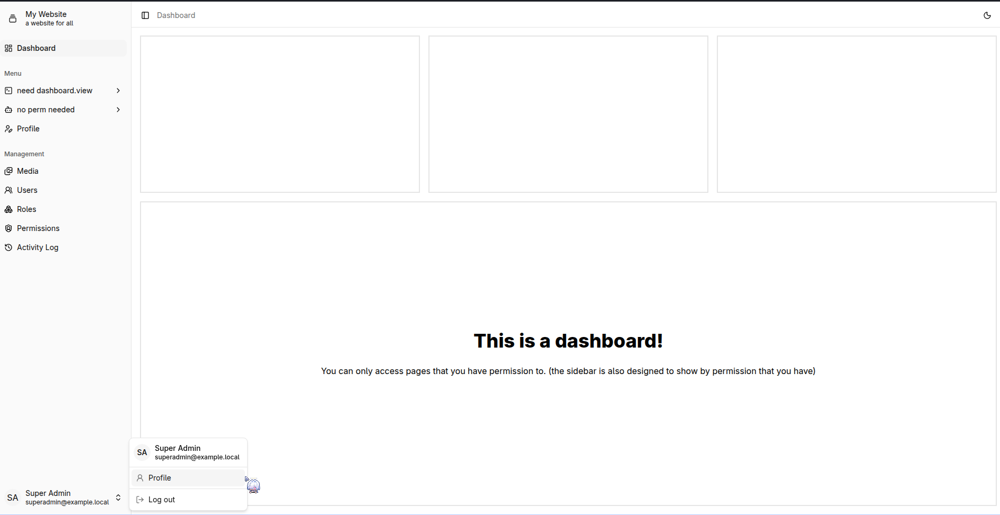                                       |
| **Auth**               | 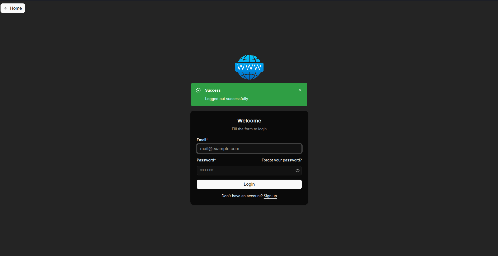 <br/> 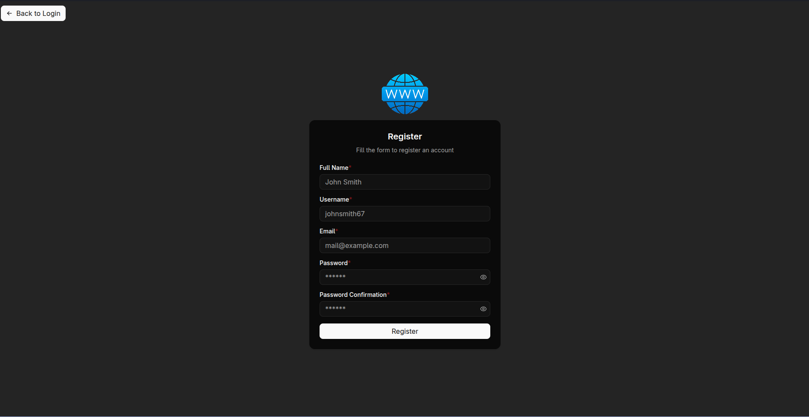 <br/> 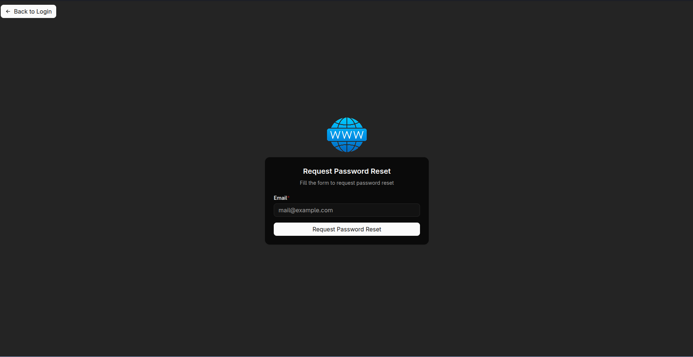 |
| **Media**              | 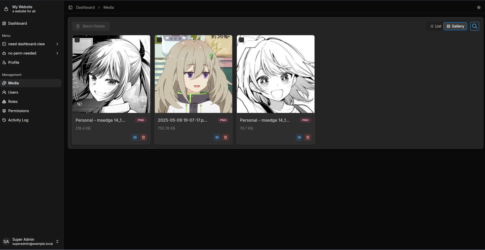 <br/> 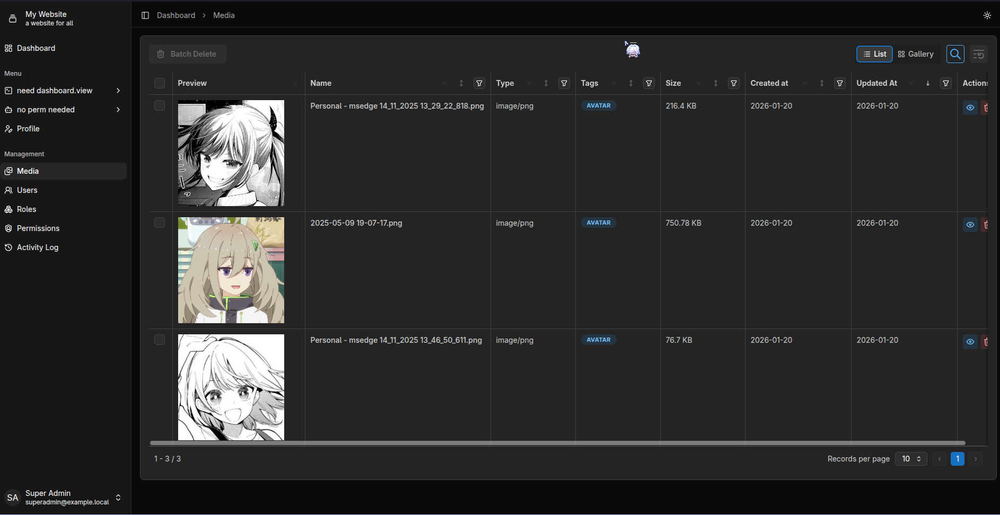                               |
| **Users & Roles**      | 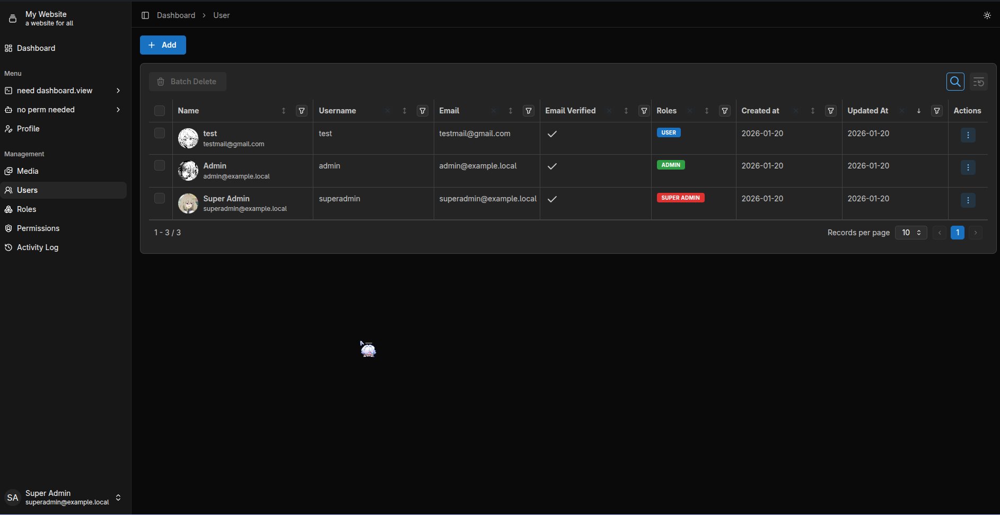 <br/> 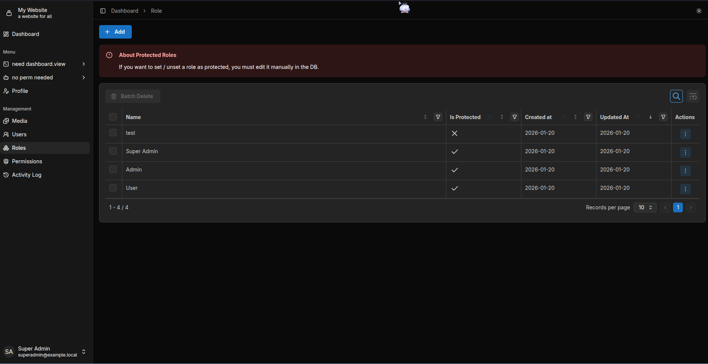                                                                   |
| **Permissions & Logs** | 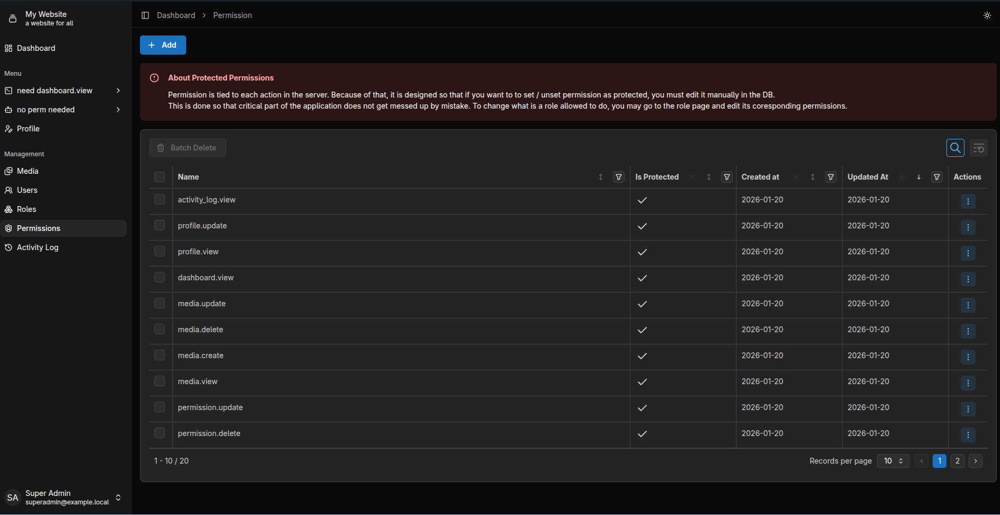 <br/>                                          |
| **Profile**            | 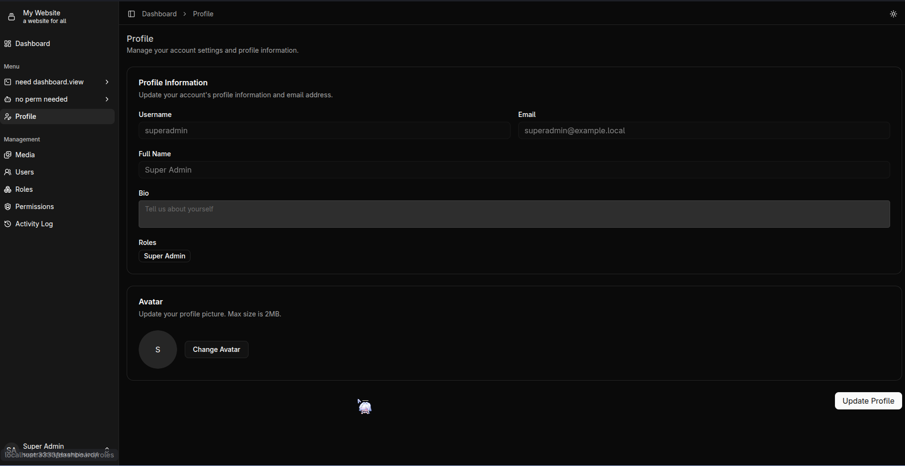                                                                                                       |

## Features

- Drive system (Local / S3) (recommended S3 \*i only tested with S3 storage)
- Role-Based Access Control (RBAC) system
- Cloudflare Captcha
- Email verification
- Auth system including:
  - register
  - login
  - logout
  - Password reset
- Media system (see all uploaded media, view media metadata, delete media)
- Permission system (manage permissions to access different parts of the application)
- Role system (manage roles, assign permissions to roles)
- Activity log (track changes like create, update, delete, etc)

## Getting Started

1. Clone the repository
2. Install dependencies with `pnpm install`
3. Configure the environment variables as defined in `.env.example`
4. Run migration with `node ace migration:run`
5. Run the development server with `pnpm dev`
6. For production / deployment, check out [adonisjs official docs](https://docs.adonisjs.com/guides/getting-started/deployment)

## Drive System

It is very recommended to use `s3` as the drive system. You can deploy for example, your own S3 compatible storage using [RustFS](https://github.com/rustfs/rustfs) or you can use provider like cloudflare R2 that give you free storage with generous limits.

## About the Roles

There are 3 default roles in this application:

1. Super Admin

   Has all access and permissions

2. Admin

   Has all access except for managing roles and permissions

3. User

   Has limited access to the application

## Things to Notes

You can correct me if im wrong or not following best practices, feel free to open an issue or PR.

For most stuff related to filenames, functions, variables, etc, its already defined in the eslint config file using the default from adonisjs. So as long as you have eslint enabled in your code editor, you should be fine. But here are some things to note:

1. For the server files. We defined it like this:

   a. Models: `app/models/model_name.ts` (Model defined using lucid orm from adonisjs)

   b. DTOs: `app/dtos/model_name.dto.ts` (we use this to keep the object type safe when sending data from backend to frontend as explained in [adonisjs docs](https://docs.adonisjs.com/guides/views-and-templates/inertia#model-serialization))

   c. Repositories: `app/repositories/model_name.repository.ts` (repositories are filled with logics on how the models interact with the database)

   d. Policies: `app/policies/model_name.policy.ts` (policies are used to check for permission to access certain parts of the application)

   e. Services: `app/services/model_name.service.ts` (services are used to handle the business logic of the application, for example: creating, updating, deleting data using the repositories define)

   f. Controllers: `app/controllers/model_name.controller.ts` (controllers are used to handle the http requests and responses)

   g. The flow is like this: Define models -> make the DTO -> make the repository -> make the service -> make the policy -> make the controller -> make the inertia page in the frontend. (Most of the stuff are already extended class and have base template that you can copy paste easily)

2. Middleware is stored in `app/middleware` folder. Read more about middleware in the [AdonisJS docs](https://adonisjs.com/docs/middleware). Please note that we check for permission in controllers, not in the middleware because i dont think adonisJS middleware is capable of doing that. But we make it as simple as possible. Example: \

```tsx
// We use .authorize and changes are made to the exceptions/handler to make it work just like when we use .denies
async viewCreate({ bouncer, inertia }: HttpContext) {
   await bouncer.with('xxxpolicy').authorize('viewCreate')
  // rest of the code...
}

async create({ bouncer, request, response }: HttpContext) {
  try {
    const payload = await request.validateUsing(createEditUserValidator)
    await bouncer.with('RolePolicy').authorize('create', payload, request)

    await this.service.create(payload)

    return response.status(200).json({
        status: 'success',
        message: `Successfully create stuff`,
    })
  } catch (error) {
    return response.status(error.status || 500).json({
      status: 'error',
      message: error.messages?.[0]?.message || error.message || 'Something went wrong',
    })
  }
}
```

3. For validators its stored in `app/validators` folder. We then define the `inferred` type in `shared/types/inferred.d.ts` file. We can then import it in backend apps or in the frontend inertia pages.
4. For the database table name, column name, etc, we configured it to be in snake_case. You can see for example in [user.ts](app/models/user.ts) we define `static namingStrategy = new SnakeCaseNamingStrategy()`. You can modify this for yourself easily in the [`_naming_strategy.ts`](app/models/_naming_strategy.ts) file located in the models folder if you want to, but i recommend to do it like this for less confusion. So the correct example is that lets say we have`created_at` column defined in `users` table, then when we acces it it shold also be `user.created_at` and it is the same when inputting data to the database.
5. For the entrypoint of the frontend, its in `inertia/app/app.tsx` and `inertia/app/ssr.tsx`. You can read more about these in the [inertia docs](https://inertiajs.com/server-side-rendering).
6. For the frontend:

   a. We store the inertia pages in `inertia/pages` (you can adjust this according to how you call the pages in the controllers in backend)

   b. Components is stored in `inertia/components` & layouts in `inertia/layouts`.

   c. For theming, we use [mantine](https://mantine.dev/) and [tailwind](https://tailwindcss.com/). For the components, we can use both mantine and tailwind. For this project i mostly use tailwind for the looks stuff with the help of shadcn and mantine for when it comes to the data input in dashboard.

To make website icon i recommend this 2 websites:

- [https://favicon.io/](https://favicon.io/)
- [https://maskable.app/editor](https://maskable.app/editor)
